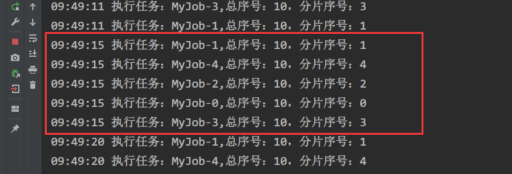

# elastic-job-demo

## 使用方法

### 需要环境

* java8
* zookeeper 3.5.x 以上

### 运行

* 启动zookeeper
* 配置文件config.properties中设置zookeeper IP和端口
* 运行MyJobDemo
* 观察日志

## 运行结果

### 负载均衡

#### 10个任务，启动一台机器

日志上可以看到，10个任务都在该机器上执行

#### 10个任务 2台机器

* 机器1

  

* 机器2

  

  可以看到，每个机器上分配了5个任务

  

  #### 10个任务 3台机器

  * 机器1

    

  * 机器2

    

  * 机器3

    

可以看到，三台机器分配的任务量是3:4:3

## 监听器

### 使用方法

* 实现自己的Listener，如MyJobListener.java
* 新建SPI标识文件，文件见/resources/META-INF/services/org.apache.shardingsphere.elasticjob.infra.listener.ElasticJobListener
* 在文件中加入自己的Listener实现类完整包路径

### 运行结果

可以看到，任务执行前后，执行了监听器的内容。

## 还存在的问题

1. ### 目前无法动态新增任务

   根据开发者的issue #1484反馈，暂时不支持动态添加/修改任务，需要等3.1.x版本考虑加入

   

   解决方案：

   1.有第三方实现了动态添加功能

   https://github.com/yinjihuan/elastic-job-spring-boot-starter

   文章：

   https://juejin.cn/post/6844903945475719176

   https://blog.csdn.net/shn1994/article/details/93873479

   这些都是根据elasticjob 2.1.5实现的，不适配目前的3.0.0-RC版本。（3.0.0-RC也不是稳定版，不适合当前环境）。

   使用elasticjob 2.1.5+第三方动态添加任务方案

   

   2.先自行研究实现动态添加任务功能，等官方推出新版本后再替换。

   

2. ###  3.x版本尚未有稳定版，不适合生产环境。Github项目维护进度缓慢。

### 